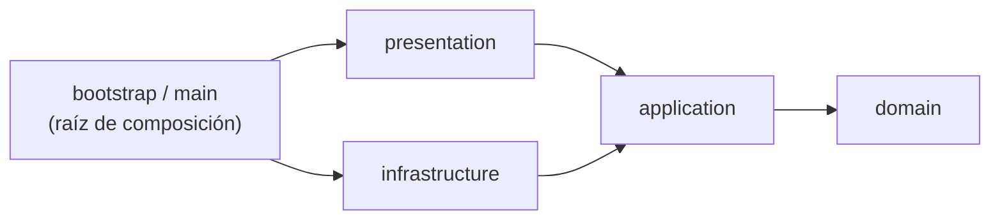

# Estructura del proyecto

Qué hay en cada carpeta, cómo se organiza el código por dentro y qué reglas de
arquitectura se verifican automáticamente. Para levantar el entorno, ver
[entorno-local.md](entorno-local.md); para el flujo de trabajo con git,
[CONTRIBUTING.md](../CONTRIBUTING.md).

## Vista general

Un solo repositorio con **tres desplegables** (API, worker del agente y
servicio de transcripción), la **aplicación web** y un **paquete común** con el
contrato entre ellos.

```
agilina/
├── shared/    Contrato worker ↔ API, enums y textos i18n (Python)
├── api/       API en FastAPI: un paquete por contexto, cada uno en cuatro capas
├── agent/     Worker de LiveKit Agents: todo lo que ocurre durante la ceremonia
├── stt/       Servicio de transcripción con faster-whisper (GPU)
├── web/       Aplicación web en Angular
├── tests/     Pruebas de Python: un árbol por pieza, con unit/ e integration/ (ver testing.md)
├── infra/     Compose del entorno, Dockerfile de Python, realm versionado, scripts
├── docs/      Documentación técnica y decisiones arquitectónicas (ADR)
├── .github/   Pipeline de verificación, plantillas y validación de commits
├── Makefile   Punto de entrada: levantar, probar, verificar y actualizar los locks
└── pyproject.toml   Workspace de uv y configuración de ruff, mypy, pytest e import-linter
```

Los tres desplegables son procesos distintos porque tienen vidas distintas: el
worker vive lo que dura la ceremonia, la API es de larga vida y la
transcripción necesita GPU. Comparten repositorio para que el contrato entre
ellos sea código compartido y no documentación que se desactualiza.

## Arquitectura: limpia, hexagonal y por contextos

Cada pieza sigue **Clean Architecture** con puertos y adaptadores (hexagonal) y
se organiza por **contexto delimitado** (DDD) antes que por capa técnica.

### Las cuatro capas

| Capa | Qué contiene | Puede importar |
| --- | --- | --- |
| `domain` | Entidades, agregados, objetos de valor, eventos y reglas de negocio. Código puro: sin frameworks | Solo `domain` |
| `application` | Casos de uso (comandos y consultas), puertos de entrada y de salida, DTO | `domain` |
| `presentation` | Adaptadores de entrada: routers HTTP, esquemas de petición y respuesta, CLI, trabajos de la sala | `application` (y `domain` por sus tipos) |
| `infrastructure` | Adaptadores de salida: base de datos, Keycloak, correo, SDK de terceros, configuración | `application` y `domain` |



**La regla de dependencia:** las flechas solo apuntan hacia adentro.
`presentation` e `infrastructure` no se conocen entre sí: se encuentran
únicamente en la **raíz de composición** (`bootstrap/` en la API, `main.py` en
el worker y en la transcripción, `app.config.ts` en la web), que es el único
lugar donde se elige qué adaptador concreto atiende cada puerto.

Dos consecuencias prácticas:

- Cambiar de proveedor (Whisper por otro STT, SMTP por SES) es escribir un
  adaptador nuevo y cambiar una línea en la raíz de composición.
- La capa `presentation` declara lo que necesita (por ejemplo,
  `get_readiness_query`) y la raíz de composición se lo entrega con
  `dependency_overrides` de FastAPI. Así nunca importa infraestructura.

### Comandos y consultas (CQRS pragmático)

- **Comando:** cambia el estado. Carga el agregado por su repositorio, ejecuta
  el comportamiento, persiste con una unidad de trabajo y publica eventos.
- **Consulta:** solo lee. Va directo a SQL y devuelve DTO, sin pasar por los
  agregados.
- Una sola base de datos, sin *event sourcing* y sin bus genérico: cada
  endpoint recibe su manejador por inyección de dependencias.

Hoy solo existen consultas (`GetLiveness` y `GetReadiness`, en
`api/.../shared/application/health.py`); los comandos llegan con las primeras
historias de dominio.

### Contextos delimitados

Salen de los componentes de la API del documento de arquitectura. Cada uno es un
paquete directo bajo `agilina_api/`, con las capas que necesite, y **no importa
a otro contexto**: se hablan por los casos de uso o los eventos del otro.

| Contexto | Responsabilidad | Estado |
| --- | --- | --- |
| `ceremonies` | Contrato con el worker del agente | Solo `presentation` (501 hasta HU-56) |
| `identity` | Invitaciones, activación de cuenta, vínculo con Keycloak, etiqueta del rol | Invitaciones (HU-02) completas en el servidor: dominio, casos de uso, persistencia, API HTTP, adaptador de Keycloak y `make invite`; HU-03 y HU-04 después |
| `teams` | Equipos, membresía, sprint, modo, idioma, preferencias | Equipo y membresías: dominio, casos de uso (`CreateTeam`, `AddTeamMember`), consulta de administradores y persistencia (HU-02); lo demás con HU-05, 06, 07… |
| `postprocessing` | Resumen, action items, flujo de aprobación | Planeado (Release 2–3) |
| `integrations` | Credenciales por equipo y adaptadores de Slack, Jira y Graph | Planeado (Release 3) |

`shared/` no es un contexto: contiene lo transversal (configuración, base de
datos, planificador, sondas de salud) con las mismas cuatro capas.

El **equipo es el tenant**: todo repositorio y toda consulta de un contexto con
datos de equipo deben exigir el `team_id` en su firma.

## Cada pieza por dentro

### `api/`

```
api/
├── pyproject.toml
├── alembic.ini
├── migrations/                       Alembic; env.py lee la URL de la configuración
│   └── versions/
├── src/agilina_api/
│   ├── bootstrap/                    Raíz de composición: app.py (fábrica, lifespan, cableado), container.py (todo cableado a sus adaptadores reales), context_adapters.py (lo que conecta identity con teams) e invite.py (`make invite`)
│   ├── shared_kernel/                Bloques base del dominio: Entity, AggregateRoot, DomainEvent, DomainError
│   ├── shared/
│   │   ├── application/              Consultas de salud y los puertos Clock, UnitOfWork, Mailer y EmailRenderer
│   │   ├── infrastructure/           settings, logging, base de datos, planificador, reloj, sonda SQL, correo SMTP y plantillas de correo (Jinja2)
│   │   └── presentation/http/        Router de salud y dependencias declaradas
│   ├── identity/                     Contexto (HU-02): dominio (Invitation, AppUser), puertos y DTO de lectura, persistencia
│   ├── teams/                        Contexto (HU-02 lo necesita; HU-05 en adelante lo amplía): dominio (Team con sus membresías) y persistencia
│   └── ceremonies/
│       └── presentation/http/        Router del contrato del agente
```

Las pruebas de la API no están aquí sino en `tests/api/`, con la misma estructura
(ver [testing.md](testing.md)).

La forma que tendrá cada contexto con dominio (por ejemplo `identity`):

```
identity/
├── domain/            model/ (agregados y objetos de valor), events.py, errors.py, repositories.py
├── application/       ports/ (inbound y outbound), commands/, queries/, dtos.py
├── presentation/      http/ (router, schemas, presenters), cli/
└── infrastructure/    persistence/ (modelos ORM, mapeadores, repositorio, consultas), keycloak/, mail/
```

Dónde va cada puerto: las **interfaces de repositorio** hablan el lenguaje de
los agregados y van en `domain`; los demás puertos de salida (proveedor de
identidad, correo, reloj, consultas de lectura) responden a lo que necesita el
caso de uso y van en `application/ports/outbound`. Los modelos ORM **no** son
las entidades del dominio: viven en `infrastructure` y se convierten con
mapeadores.

La app arranca con `agilina_api.bootstrap.app:app` (`make api`).

### `agent/`

```
agent/src/agilina_agent/
├── main.py                       Raíz de composición y punto de entrada de LiveKit
├── domain/facilitation.py        Máquina de estados de la daily (sin LiveKit, audio ni red)
├── application/ports.py          Transcriber, SpeechSynthesizer, AgilinaApi
├── presentation/room_job.py      Lo que el worker hace una vez por ceremonia
└── infrastructure/               Adaptadores: cliente HTTP de la API, STT, TTS, ajustes, logs
```

El worker **no accede a la base de datos**: solo usa dos operaciones de la API
(obtener el contexto y entregar el resultado), con una cuenta de servicio. Ver
[contrato-worker-api.md](contrato-worker-api.md).

### `stt/`

```
stt/src/agilina_stt/
├── main.py                        Raíz de composición: app, transcriptor y ServiceInfo
├── domain/transcription.py        Resultado de transcribir un segmento
├── application/ports.py           Transcriber y ServiceInfo
├── presentation/http/             router, schemas y dependencias declaradas
└── infrastructure/                settings y transcriptores (simulado y faster-whisper)
```

En modo simulado (`AGILINA_STT_SIMULATED=true`) no carga el modelo, de modo que
corre en cualquier máquina y en el pipeline.

### `shared/`

```
shared/src/agilina_shared/
├── contract.py    CeremonyContext, CeremonyResult, ParticipantContext, TranscriptSegment
├── enums.py       OperationMode, TeamRole, Language, CeremonyType, CeremonyStatus
└── i18n.py        Plantillas de lo que Agilina dice, en español e inglés
```

Es el *lenguaje publicado* entre desplegables, no un dominio. No puede importar
ninguno de los tres desplegables. Un cambio incompatible sube
`CONTRACT_VERSION` y se declara con `BREAKING CHANGE` en el pie del commit.

### `web/`

```
web/src/app/
├── app.config.ts                    Raíz de composición: enlaza puertos con adaptadores
├── app.routes.ts                    Mapa de pantallas, con carga diferida
├── core/i18n/                       Servicio de textos y catálogos es.json / en.json
└── features/<contexto>/
    ├── domain/                      Modelos puros (sin Angular ni rxjs)
    ├── application/                 Puertos (clases abstractas) y facades con señales
    ├── infrastructure/              Adaptadores HTTP
    └── presentation/                Componentes y páginas
```

Hoy solo existe `features/status` (la pantalla de estado del entorno). Las
demás pantallas llegan con sus historias.

### `infra/` y los contenedores

Todo corre en contenedores (solo hacen falta Docker y `make`):

| Archivo | Para qué |
| --- | --- |
| `docker-compose.yml` | El entorno: `postgres`, `pgadmin`, `keycloak`, `mailpit`, `api` y `web`; con el perfil `voice`, `stt` y `agent`; con el perfil `tools`, los contenedores de un solo uso de las pruebas y verificaciones |
| `docker/python.Dockerfile` | Imagen de Python con varios objetivos: `dev` (todas las dependencias y las herramientas; el código se monta en `/app`) y `api` (producción: solo sus dependencias, código instalado, sin uv y sin root) |
| `../web/Dockerfile` | Imagen de la web: `dev` (`ng serve`), `test` (con Chromium), `build` y `prod` (nginx sin privilegios) |
| `keycloak/realm-agilina.json` | Realm, clientes y roles versionados: no se configura a mano |
| `postgres/01-extensions.sql` | Extensiones y zona UTC, solo al crear el volumen |
| `wait-for-services.sh` | Espera a que Postgres y Keycloak respondan antes de migrar |

Los contenedores de desarrollo corren con tu usuario (`HOST_UID` y `HOST_GID`,
que exporta el `Makefile`), de modo que los archivos que crean son tuyos. Por eso
conviene ejecutar siempre con `make` y no con `docker compose` a mano. Las
imágenes de producción de `stt` y `agent` llegan con el despliegue (HU-38).

## Reglas que se verifican solas

Se ejecutan con `make verify`, en la CI y (mypy e import-linter) antes de cada
`push`.

| Herramienta | Qué hace cumplir |
| --- | --- |
| `import-linter` (`make arch`) | Capas de la API, del worker y de la transcripción; la raíz de composición va encima de todo; los contextos de la API no se importan entre sí y `shared` y `shared_kernel` quedan debajo; el dominio de la API (y `shared_kernel`) no conoce FastAPI, SQLAlchemy, Pydantic ni `httpx`; el dominio del worker no conoce LiveKit ni `httpx`; el contrato compartido no depende de ningún desplegable |
| ESLint (`make lint`) | En la web, `presentation` no importa `infrastructure` y `domain` no conoce Angular ni rxjs |
| `mypy --strict` (`make typecheck`) | Tipado estricto en los cuatro paquetes de Python |
| `ruff` | Formato y reglas de estilo y seguridad |
| Pruebas | Prueba de que toda clave i18n existe en español e inglés |

Para romper una regla de capas hay que cambiar la configuración, y eso se ve
en el code review.

## Convenciones de nombres

- **Código en inglés:** identificadores, comentarios, archivos, rutas HTTP,
  campos JSON, variables de entorno y objetivos de `make`.
- **Español:** commits, pull requests y esta documentación. Los textos que ve
  el usuario van en español e inglés mediante i18n, nunca dentro del código.
- Los valores de los enums coinciden con los tipos de PostgreSQL
  (`support`, `autonomous`, `admin`, `member`…).
- Las claves i18n de la web se agrupan por funcionalidad (`status.title`).

## Cómo agregar algo nuevo

**Un caso de uso en un contexto existente**

1. Si hay una regla de negocio nueva, agrégala en `domain` y pruébala sin base de datos.
2. Escribe el comando o la consulta en `application` con sus puertos.
3. Implementa los puertos de salida en `infrastructure`.
4. Expón el caso de uso en `presentation` y cabléalo en la raíz de composición.
5. `make verify` en verde.

**Un contexto nuevo**

1. Crea el paquete bajo `agilina_api/` con solo las capas que necesite.
2. Agrégalo a los `containers` y a la lista de contextos hermanos (`a | b | c`) de
   los contratos de import-linter en el `pyproject.toml`, y su paquete `domain` al
   contrato de "el dominio no conoce frameworks".
3. Importa sus modelos ORM en `api/migrations/env.py` para que Alembic los vea.
4. Registra su router en `bootstrap/app.py`.

## Dónde está el porqué

- Cómo se organizan las pruebas (árbol espejo, *Data Builders*, cobertura del 100 %): [AD-25](adr/0025-organizar-las-pruebas-con-arbol-espejo-builders-y-cobertura-total.md).
- La decisión de organizar el código así: [AD-21](adr/0021-organizar-el-codigo-en-contextos-y-capas.md).
- Cómo se envía el correo (SMTP, Mailpit y el proveedor por configuración): [AD-23](adr/0023-enviar-correo-por-smtp-con-mailpit-y-proveedor-configurable.md).
- Cómo nace el primer Administrador sin registro público: [AD-22](adr/0022-emitir-por-cli-la-invitacion-del-primer-administrador.md).
- Cómo se escribe el código dentro de esta estructura: [code-conventions.md](code-conventions.md).
- El vocabulario del dominio: [glossary.md](glossary.md).
